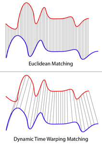

# Time series Library for .NET

ADN.TimeSeries is a cross-platform open-source library which provides time series utilities to .NET developers.

[](https://travis-ci.org/andresdigiovanni/ADN.TimeSeries)
[](https://www.nuget.org/packages/ADN.TimeSeries/)
[](https://bettercodehub.com/)
[](https://sonarcloud.io/dashboard?id=andresdigiovanni_ADN.TimeSeries)
[](https://sonarcloud.io/dashboard?id=andresdigiovanni_ADN.TimeSeries)
[](https://opensource.org/licenses/MIT)

## Basic usage

Dynamic time warping example:
<br/>


```csharp
var serie1 = new double[] { 0, 1, 2, 3, 4 };
var serie2 = new double[] { 0, 1, 2, 3, 4 };
int sakoeChibaBand = -1;
var dtw = new DTW(serie1, serie2, sakoeChibaBand);

var result = dtw.GetPath();

/*
 result is [(0, 0), (1, 1), (2, 2), (3, 3), (4, 4)]
 */
```

## Installation

ADN.TimeSeries runs on Windows, Linux, and macOS.

Once you have an app, you can install the ADN.TimeSeries NuGet package from the NuGet package manager:

```
Install-Package ADN.TimeSeries
```

Or alternatively you can add the ADN.TimeSeries package from within Visual Studio's NuGet package manager.

## Examples

Please find examples and the documentation at the [wiki](https://github.com/andresdigiovanni/ADN.TimeSeries/wiki) of this repository.

## Contributing

We welcome contributions! Please review our [contribution guide](CONTRIBUTING.md).

## License

ADN.TimeSeries is licensed under the [MIT license](LICENSE).
